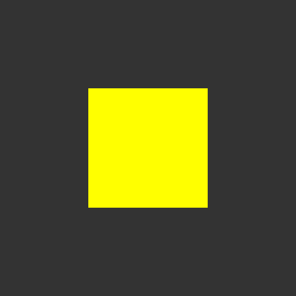

### Step 1. Hello WebGL

It is minimal basics to start yellow square on gray background.

It is not much to show, but requires 200 code lines of low-level programming.

If you don't want to use low-level programming, you can use additional
[WebGL frameworks](https://en.wikipedia.org/wiki/List_of_WebGL_frameworks)
to simplify code development: Three.js, Babylon.js, etc.

Also I advise you to visit [AlteredQualia](https://alteredqualia.com)
website to view some interesting WebGL experiments.
