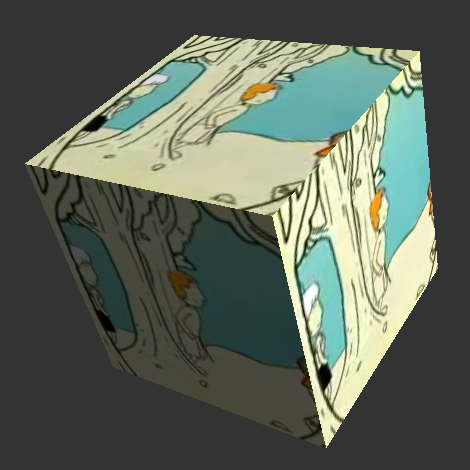

### Step 8. Create video cube from 6 different videos

Make 6 planes and position them so they form a cube.
Put a ```<video>``` element to retrieve frames for texture on each plane.
Draw with 6 draw calls, one for each plane.


