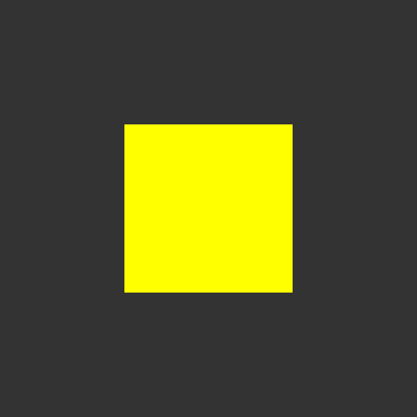
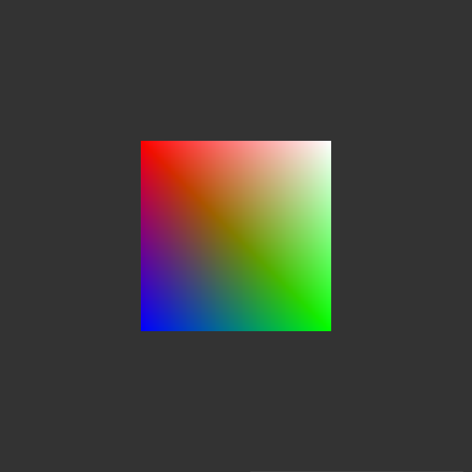
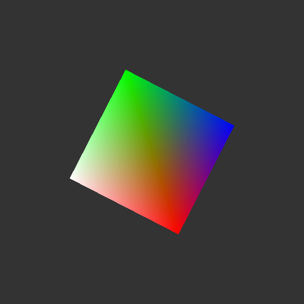
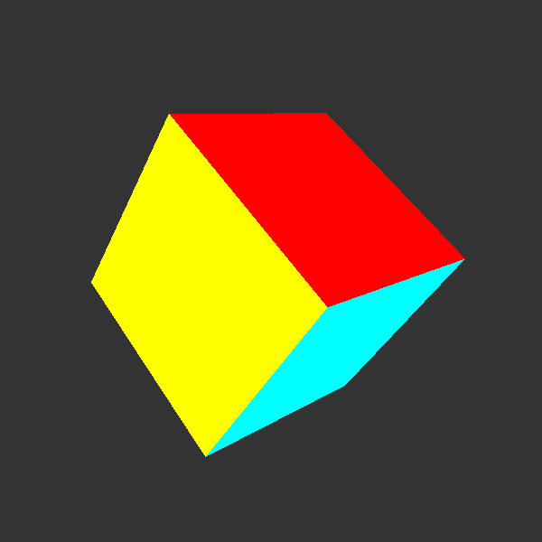
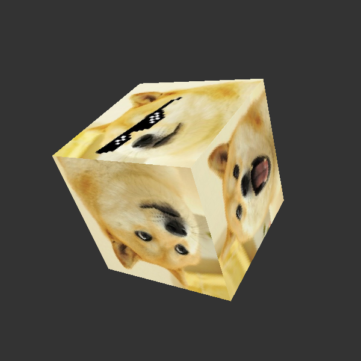
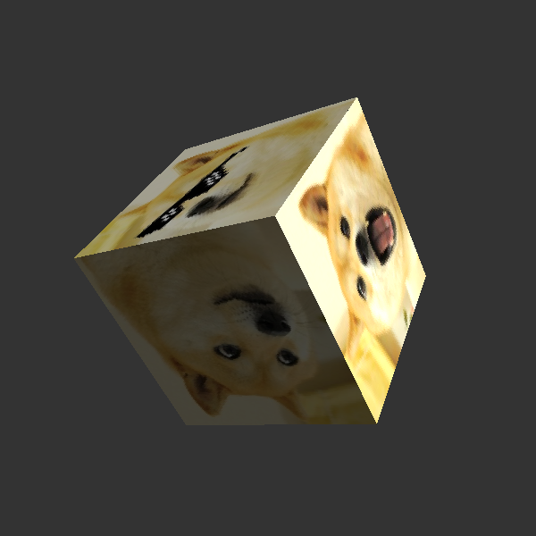
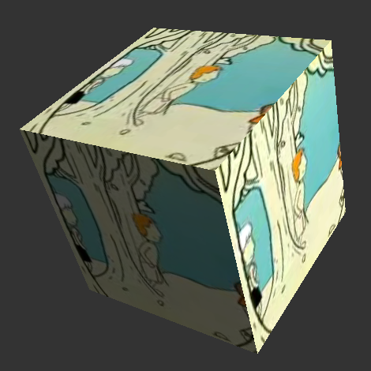

## WebGL. GPU for browser

[WebGL](https://en.wikipedia.org/wiki/WebGL) is a JavaScript API for rendering
interactive 2D and 3D graphics within any compatible web browser without the use
of plug-ins. WebGL is fully integrated with other web standards,
allowing GPU-accelerated usage of physics and image processing and effects
as part of the web page canvas.

This repository is based on 2 open source tutorials for beginners:
1. [Mozilla WebGL tutorial](https://developer.mozilla.org/en-US/docs/Web/API/WebGL_API/Tutorial)
2. [WebGL Fundamentals](https://webglfundamentals.org/)
from the ground up. No magic.

Code is divided into separate independent steps and steadily increases
complexity with each step.

Following technologies are used:
1. Javascript programming language;
2. basics of HTML and CSS necessary to start examples;
3. [glMatrix](http://glmatrix.net/) high performance vector and matrix
math library.

Javascript, HTML and CSS are embedded in each web-browser.

Unfortunately, version 3.0 of glMatrix does not work with Mozilla WebGL
tutorials right now. So I had to download previous version **2.8.1** from
[gl-matrix GitHub](https://github.com/toji/gl-matrix/tags).

After download I copied ```gl-matrix.js``` file from
```gl-matrix-2.8.1.zip/gl-matrix-2.8.1/dist/gl-matrix.js``` to
[```webgl/data/``` directory](https://github.com/foobar167/webgl/tree/master/data)
of the GitHub repository.

### Step 1. [Hello WebGL](01_hello_weblg)

It is minimal basics to start yellow square on gray background.



It is not much to show, but requires 200 code lines of low-level programming.

If you don't want to use low-level programming, you can use additional
[WebGL frameworks](https://en.wikipedia.org/wiki/List_of_WebGL_frameworks)
to simplify code development: Three.js, Babylon.js, etc.

Also I advise you to visit [AlteredQualia](https://alteredqualia.com)
website to view some interesting WebGL experiments.

### Step 2. [Apply gradient color](02_apply_color)

Adding gradient color to the yellow square,
which requires 40 additional lines of code.



### Step 3. [Rotate the square](03_rotate_it)

Rotating the square from the previous example.
Only 15 additional lines of code needed.



### Step 4. [3D cube](04_create_3d)

Converting a rotating 2D square into a rotating 3D cube.
Plus 75 lines of code to make it.



### Step 5. [Use texture](05_use_texture)

Using texture for a 3D cube.
Around 114 code lines are needed to add texture for a 3D cube.



### Step 6. [Set lighting](06_set_lighting)

Setting the lighting for the cube to make it look more realistic.
Lighting is added using 77 lines of code.
There are 530 Javascript lines for now.



[Run the cube in your browser](https://foobar167.github.io/page/webgl-cube/cube.html)

### Step 7. Create video cube

Create ```<video>``` element to retrieve frames for texture.

Replace static texture with frames from an MP4 video file that's playing.



<br/><br/>

**I'll make further development of WebGL steps soon.
Stay in touch and thanks for attention.**
:wave: :octocat:
